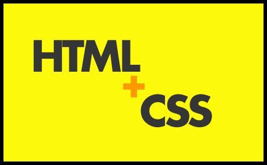

- 类选择器和id选择器的区别和使用,id选择器只能够用一次,类选择器可以用多次,使用方法是一致的.

- css样式的优先级, 外部 `<` 内嵌 `<` 内联

-  `*{ … }`  通用选择器  

- `food >li `子类选择器

- 伪类选择符 鼠标滑过 显示的效果样式..
```
 a:hover{color:red;}
```
<!-- more -->

- 段落缩进
```
 p{text-indent:2em;}
```

- 行高(行间距) 
```
p{line-height:1.5em;}
```

- 文字间隔
``` 
h1{
    letter-spacing:50px;
}
```

- 布局属性text-align (left,center,right) 与iOS差不多


-  常用的块状元素有：
```javascript
<div>、<p>、<h1>...<h6>、<ol>、<ul>、<dl>、<table>、<address>、<blockquote> 、<form>
```
- 常用的内联元素有：
```
<a>、<span>、<br>、<i>、<em>、<strong>、<label>、<q>、<var>、<cite>、<code>
```
- 常用的内联块状元素有：
```
、<input>
```
- 将div等块元素转换成内联元素
```
 div{display:inline;}
<div style="color:red">我是谁</div><br>
```

-   盒子模型
填充也可分为上、右、下、左(顺时针)。如下代码：
```
div{padding:20px 10px 15px 30px;}
```
顺序一定不要搞混。可以分开写上面代码：
```
div{
   padding-top:20px;
   padding-right:10px;
   padding-bottom:15px;
   padding-left:30px;
}
```
这上右下左也是醉了 和苹果的(上左下右)刚好相反      一个顺时针  一个逆时针
如果上、右、下、左的填充都为`10px`;可以这么写
```
div{padding:10px;}
```
如果上下填充一样为`10px`，左右一样为`20px`，可以这么写：
```
div{padding:10px 20px;}
```

- 定位
`absolute`:表里如一，移动了就是移动了。
`relative`:只是表面显示移动了，但实际还在文档流中原有位置，别的元素无法占据。
`fixed`:传说中的右下角悬浮小广告。
`Relative`与`Absolute`组合使用：子元素定位时，它的前辈元素必须设置有`position`属性，从而子元素使用`absolute`进行定位
 结合 `left` `top` `right` `bottom`可以灵活各种布局的定位